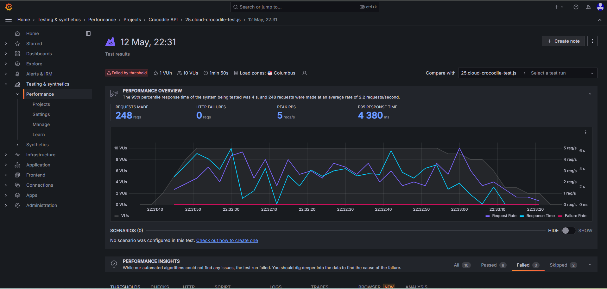

## 🚀 Introdução:

Através do framework K6 Performance Testing, foi utilizado algumas plataformas para aprendizagem práticas transmitidas no curso Introduction to k6 for Beginners, Udemy.

## 📚 Aprendizagens:
- Instalação e configuração inicial do K6.
- Fundamentos dos testes de desempenho e terminologia relevante.
- Validação de respostas e elaboração de afirmações.
- Exploração da interface de linha de comando (CLI) do K6.
- Utilização das ofertas do Grafana Cloud K6 para uma experiência completa.
- Integração de testes K6 em servidores CI/CD renomados, como Jenkins, GitLab CI e Circle CI.

## 💻 Tecnologias e ferramentas
- K6
- JavaScript
- Grafana Cloud
- Jenkins

## 🤖 Como executar
- Executar localmente

```
k6 run {nome do arquivo}.js
```

- Executar no Grafana Cloud

```
k6 cloud {nome do arquivo}.js
k6 run {nome do arquivo}.js -o cloud  
```

- Gerar relatórios em arquivos .json

```
k6 run {nome do arquivo}.js --out json={nome do relatorio}.json
k6 run {nome do arquivo}.js --summary-export={nome do relatorio}.json
```

- Executar no Jenkins integrado ao Grafana Cloud
```
pipeline {
    agent any

    environment{
        K6_CLOUD_TOKEN = credentials("nome_variavel")
        K6_CLOUD_PROJECT_ID = 'id_grafana_cloud'
    }

    stages {
        
        stage('Checkout') {
            steps {
                git branch: 'main', url: 'link_repositorio'
            }
        }
        
        stage('K6') {
            steps {
                bat 'k6 cloud {nome do arquivo}.js --quiet'
            }
        }
    }
}
```

## 📷 Evidências do teste:
Seguem as evidências da execução do teste no Jenkins integrando ao Grafana Cloud apresentando erro no threshold.
